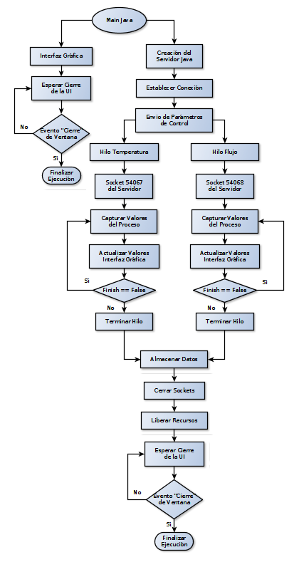
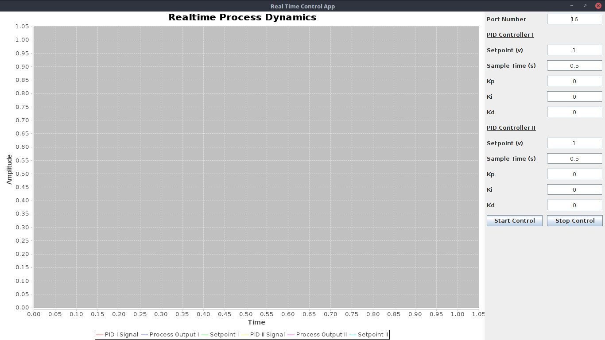
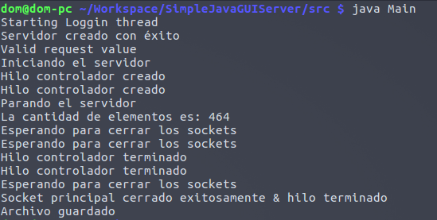

# Realtime Project Java Server
Este repositorio contiene la implementación del servidor Java incluyendo la interfaz gráfica y otras utilidades para realizar el muestreo, controlar, gráficar y guardar los datos capturados por la aplicación.

## Arquitectura Simplificada de la Aplicación


La aplicación en su componente gráfica (interfaz de usuario) se muestra a continuación, allí se pueden apreciar los parámetros que esta acepta y el mecanismo de interacción con la misma.



Para asegurar que todo ha salido según lo previsto, la aplicación en Java también muestra información a través de la terminal de comando donde está siendo ejecutado el Servidor, un ejemplo de ello se muestra en la siguiente imagen.



Para mayor información completa, puede remitirse a la documentación adicional del [cliente desarrollado en C](https://github.com/LoadCode/Realtime-Project-C-Client) (Esta documentación aún se encuentra en desarrollo).


### Compilar:
Para compilar este proyecto, en primer lugar debe ejecutar la siguiente línea en la
terminal donde compilará y ejecutará el programa.

```bash
export CLASSPATH=$CLASSPATH:./lib/jfreechart-1.0.19.jar:./lib/jcommon-1.0.23.jar
```

### Ejecutar:
Para ejecutar la aplicación escriba en la terminal:
	`java Main`


### Notas Importantes
Tenga en cuenta que el funcionamiento tanto de servidor como de cliente se presenta en el siguiente orden:

*	Ejecute el servidor Java en una terminal (solo ejecute, no inicie la adquisición aún)
*	Ejecute el cliente en C en otra terminal (./main y verifique que ningún error se haya generado en ninguna de las dos terminales)
*	Puede dar inicio a la adquisición de datos presionando el botón adecuado en la interfaz gráfica del servidor Java

